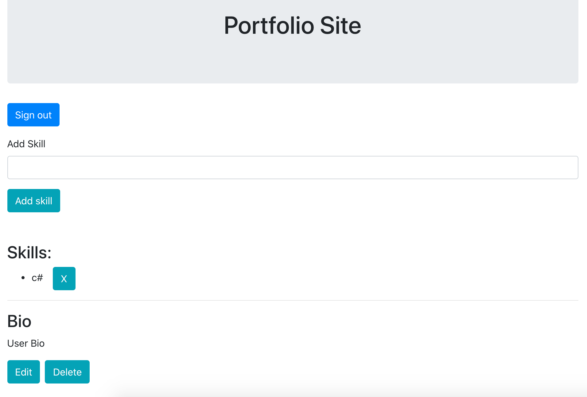

# Portfolio Site

#### React Redux FireBase application, 09/29/2020

#### By _**Evgeniya Chernaya**_

## Description

Portfolio Site is a React Redux FireBase application where a user can signIn/signUp and add skills and bio to his personal page.
Practice of working with React, Redux, Cloud Firestore for creating all CRUD functionality and user authentication.

 

## Setup/Installation Requirements

* Clone the repository to your desired directory (git clone https://github.com/janecher/portfolio-site)
* Do "npm install", then "npm run build" in the terminal
* Do "npm run start" in the terminal to see the result in browser

## Specification

 

- User can signIn/signUp for user page.
- User can add/delete a skill.
- User can add/edit/delete bio.
- User can sign out.

## Known Bugs

_No known bags_

## Support and contact details

Contact me at _evgenya.chernaya@gmail.com_

## Technologies Used

  * React
  * Redux
  * FireBase
  * JavaScript
  * JSX
  * HTML
  * CSS
  * Bootstrap

### License

_This software is licensed under the MIT license_

Copyright (c) 2020 **Evgeniya Chernaya**